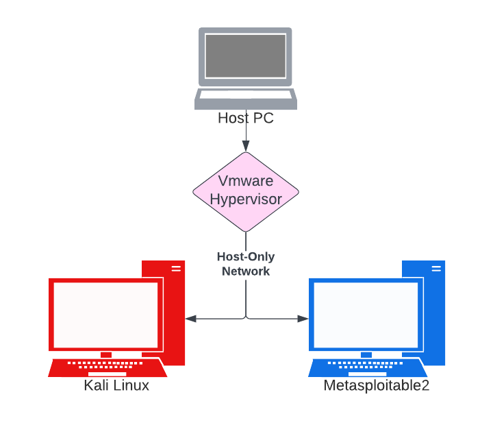
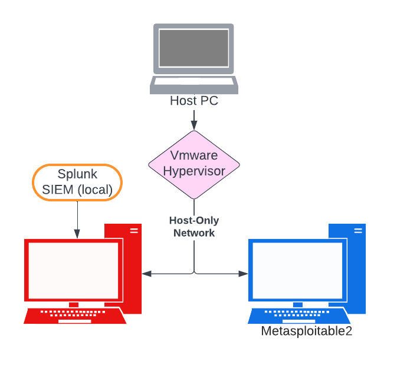

# Homelab Blueprint & Learning Journal

This document tracks the creation, evolution, and exercises performed in my self-hosted cybersecurity homelab. It includes setup steps, hands-on experiments, troubleshooting, and takeaways from each phase.

---

## Table of Contents

- [Phase 1 – Core Components](#phase1)
  - [Topology – Core Setup](#Topology_Core_Setup)
- [Phase 2 – Network Discovery](#phase2)
- [Phase 3 – Initial Exploitation](#phase3)
- [Phase 4 – Installing Splunk (SIEM Integration)](#phase4)
  - [Topology – After Splunk Installation](#Topology_Splunk_Installation)
- [Phase 5 - Splunk Log Ingestion and Detection](#phase5)
- [Phase 6 - Firewall Setup and Network Segmentation with pfSense](#phase6)
- [Next Up](#Next_Up)

---

<h1 align="center"><strong>Phase 1 - Core Components</strong></h1> <a name="phase1"></a>

### Objective:  
Set up a self-contained, safe lab environment for cybersecurity testing and exploration.

### Overview:  
This phase focuses on installing and configuring essential components: Kali Linux as the attacker machine and Metasploitable2 as the vulnerable target, both running within a host-only network using VMware Workstation.

- Downloaded **VMware Workstation**
- Deploy **Kali Linux VM**
- Installed **Metasploitable2 (Target)**
- Configured both VMs to run on **Host-Only networking** for isolation and safety

---
<a name="Topology_Core_Setup"></a><h1 align="center"><strong>Topology – Core Setup</strong></h1>

<p align="center">
  
</p>

---
<a name="phase2"></a><h1 align="center"><strong>Phase 2 - Identifying the Target Machine (Network Discovery)</strong></h1> 

### Objective:  
Identify live hosts and services within the isolated lab environment to simulate internal reconnaissance.

### Overview:  
Using tools like `ifconfig` and `nmap`, this phase simulates an attacker scanning a local network to discover targets and enumerate exposed ports and services, laying the groundwork for future exploitation.

### Steps:

1. **Verify both VMs are running and on the same network.**

2. **Open a terminal on the Kali Linux VM and identify the local IP address and subnet:**
   ```bash
   ifconfig
   ```

3. **Run a ping sweep on the subnet to discover live hosts:**
   ```bash
   nmap -sn 192.168.56.0/24
   ```

4. **Once the Metasploitable2 IP address is identified, run a basic port scan:**
   ```bash
   nmap [target_ip]
   ```

5. **Enumerate running services and their versions:**
   ```bash
   nmap -sV [target_ip]
   ```


<h3 align="center"><em>At this stage, the vulnerable system has been identified and its services have been enumerated. This completes the initial reconnaissance phase. Next, we’ll begin exploring exploitation techniques using Metasploit.</em></h3>

---
<a name="phase3"></a><h1 align="center"><strong>Phase 3 – Initial Exploitation with Metasploit</strong></h1> 

### Objective:  
Leverage known vulnerabilities to gain unauthorized access to the target system using Metasploit Framework.

### Overview:  
This phase simulates a real-world attack by exploiting the vulnerable vsFTPd service on Metasploitable2, providing experience with vulnerability identification, module selection, and command execution through a remote shell.

### Steps:

1. Identify the vulnerable service from the previous scan:
   - Port 21 is open and running `vsFTPd 2.3.4`, which is known to have a backdoor vulnerability.

2. Launch Metasploit Framework from Kali:
   ```bash
   msfconsole
   ```

3. Search for the exploit module related to vsFTPd:
   ```bash
   search vsftpd
   ```

4. Load the correct exploit module:
   ```bash
   use exploit/unix/ftp/vsftpd_234_backdoor
   ```

5. Set the target IP address:
   ```bash
   set RHOSTS [target_ip]
   ```

6. Run the exploit:
   ```bash
   exploit
   ```

<h3 align="center"><em>If successful, this will spawn a root shell on the target system. This is for educational purposes only and should never be performed outside of authorized lab environments.</em></h3>

---
<a name="phase4"></a><h1 align="center"><strong>Phase 4 – Installing Splunk (SIEM Integration)</strong></h1> 

<h3 align="center"><em>This is the only phase in the homelab that requires temporary internet access. Splunk is downloaded directly from the official site and installed on the Kali VM. After installation, return the VM to host-only mode to preserve network isolation.</em></h3>

### Objective:  
Install and configure Splunk on Kali Linux to serve as a SIEM platform for future log collection and monitoring.

### Overview:  
Splunk will be used to ingest and analyze logs from the lab environment, enabling simulated alerting and incident response workflows. This phase sets the foundation for blue team operations.

### Steps:


1. Acquire the `wget` link for the Splunk installer (Linux .deb package):
   ```bash
   wget https://download.splunk.com/products/splunk/releases/9.4.1/linux/splunk-9.4.1-e3bdab203ac8-linux-amd64.deb
   ```

2. Install the downloaded Splunk package:
   ```bash
   sudo dpkg -i splunk-9.4.1-e3bdab203ac8-linux-amd64.deb
   ```

3. Start Splunk for the first time and accept the license:
   ```bash
   sudo /opt/splunk/bin/splunk start --accept-license
   ```

<h3 align="center"><em>Splunk version numbers and filenames may change over time, adjust the URL and commands accordingly.</h3></em>

4. When prompted, set the Splunk admin username and password.

5. Access the Splunk Web Interface from a browser:
   ```bash
   http://kali:8000
   ```

6. (Optional) To manually start Splunk after reboot:
   ```bash
   sudo /opt/splunk/bin/splunk start
   ```

7. (Optional) To automatically start Splunk on system boot:
   ```bash
   sudo /opt/splunk/bin/splunk enable boot-start
   ```

---
<a name="Topology_Splunk_Installation"></a><h1 align="center"><strong>Topology – After Splunk Installation  </strong></h1> 

<p align="center">
  
</p>

---

<a name="phase5"></a><h1 align="center"><strong>Phase 5 – Splunk Log Ingestion and Detection</strong></h1>

<h3 align="center"><em>This setup captures most user-level shell activity but does not log commands executed within Metasploit (msfconsole). Metasploit operates in its own interactive shell that does not write to .zsh_history, which limits visibility into post-exploitation activity unless additional logging (e.g., screen recording, TTY logging, or direct session transcript capture) is configured. This reflects a realistic gap in endpoint monitoring and highlights the importance of layered detection strategies beyond simple shell history tracking.</h3></em>

### Objective:  
Configure Splunk to monitor *.zsh_history* in near real-time on Kali Linux to log and analyze terminal commands as part of simulated blue team operations.

### Overview:  
By setting up Splunk to watch the *.zsh_history* file, we can track executed terminal commands from the Kali Linux VM. This gives visibility into attacker behavior and supports future correlation and detection use cases. To make logs appear instantly in Splunk, we'll also configure the shell to write history after every command.

### Steps:

1. Log in to the Splunk Web Interface:
   ```bash
   http://kali:8000
   ```

2. Click on **Add Data** from the main dashboard.

3. Select **Monitor** as the data input method.

4. Choose **Files and Directories** as the data source.

5. Set the path to monitor:
   ```bash
   /home/kali/.zsh_history
   ```

6. Set the Source Type to:
   ```bash
   zsh_current
   ```

7. Leave the input settings as default, then click **Review** and **Submit**.

8. Click **Start Searching** to go to the Splunk Search & Reporting dashboard.

9. In the search bar, run a query similar to:
   ```bash
   source="/home/kali/.zsh_history" host="kali" sourcetype="zsh_current"
   ```

10. Ensure your shell writes commands to history immediately by running:
    ```bash
    fc -W
    ```

<h3 align="center"><em>If everything was set up correctly, you should now see your terminal command logs appearing in Splunk. If something isn’t working, navigate to the top right of the Splunk interface and click on Settings. Under Data Inputs, go to Files & Directories, scroll down to find the entry for `/home/kali/.zsh_history`, and delete it. Then, restart the process from Step 1 above to reconfigure the input.</em></h3>

---

<a name="phase6"></a><h1 align="center"><strong>Phase 6 – Firewall Setup and Network Segmentation with pfSense</strong></h1>

### Objective:  
Introduce a realistic network perimeter using a virtualized firewall (pfSense) to simulate internet-to-internal segmentation, enforce access controls, and monitor attack surface exposure.

### Overview:  
This phase adds a pfSense firewall between the external attacker machine (Kali Linux) and the internal lab network (Metasploitable2, Splunk). This mimics a production firewall protecting internal infrastructure from external threat actors. Only specific ports are allowed through, and all traffic is filtered or logged.

### Steps:

1. Download **pfSense CE ISO**  
   - Link: [https://www.pfsense.org/download/](https://www.pfsense.org/download/)

2. Create a new VM in VMware Workstation  
   - Mount the pfSense ISO  
   - Assign:
     - `Network Adapter 1 (WAN)` → `Custom: VMnet2`
     - `Network Adapter 2 (LAN)` → `Custom: VMnet3`

<h3 align="center"><em>You will likely have to enter the VMware virtual network editor to create VMnet2 and VMnet3, ensure dhcp is disabled for VMnet 3 as pfSense will have the automatic IP setup covered.</em></h3>

3. **Install pfSense and assign interfaces**
   - `em0` → WAN (VMnet2)  
   - `em1` → LAN (VMnet3)

4. **Set static IP addresses using pfSense CLI (Option 2):**
   ```text
   WAN (em0): 192.168.20.1/24  
   LAN (em1): 192.168.1.1/24

5. **Disable VMware DHCP on VMnet2 and VMnet3**
   - Open the **Virtual Network Editor** in VMware Workstation
   - Select both `VMnet2` and `VMnet3`
   - Uncheck **“Use local DHCP service to distribute IP address”** for both
   - Click **Apply** to save changes

6. **Configure Kali Linux (Attacker VM)**
   - Connect Kali’s network adapter to `VMnet2`
   - Assign a static IP:
     ```bash
     sudo ip addr add 192.168.20.10/24 dev eth0
     sudo ip route add default via 192.168.20.1
     ```
   - Verify connectivity:
     ```bash
     ping 192.168.20.1
     ```

7. **Configure Metasploitable2 (Target VM)**
   - Connect Metasploitable2’s network adapter to `VMnet3`
   - On boot, it should automatically get an IP from pfSense (e.g., `192.168.1.100`)
   - Confirm IP and gateway:
     ```bash
     ifconfig
     ping 192.168.1.1
     ```

8. **Re-enable pfSense filtering (if previously disabled)**
   - If you used `pfctl -d` to troubleshoot earlier, re-enable packet filtering:
     ```bash
     pfctl -e
     ```

9. **Access pfSense Web UI from LAN-side system**
   - On Metasploitable2 (or any VM connected to `VMnet3`):
     ```
     http://192.168.1.1
     ```
   - Login using the default or previously configured credentials

10. **Create a firewall rule to allow traffic from Kali to LAN**
    - Navigate to: `Firewall > Rules > WAN > Add`
    - Configure the rule as follows:
      - **Action:** Pass  
      - **Interface:** WAN  
      - **Address Family:** IPv4  
      - **Protocol:** Any (or limit to ICMP/TCP if preferred)  
      - **Source:** `192.168.20.10`  
      - **Destination:** `192.168.1.0/24`  
      - **Log packets that are handled by this rule:** ✅ (enable logging)
    - Click **Save** and then **Apply Changes**

11. **Test traffic from Kali to Metasploitable2**
    - From Kali, confirm communication through the firewall:
      ```bash
      ping 192.168.1.100
      nmap -p 21,22,80 192.168.1.100
      ```
    - Only ports allowed by pfSense should be accessible


<a name="Next_Up"></a><h1 align="center"><strong>Next Up</strong></h1>
- Phase 7