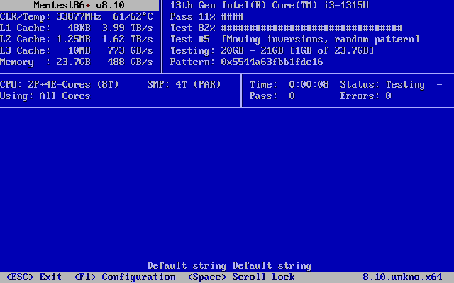
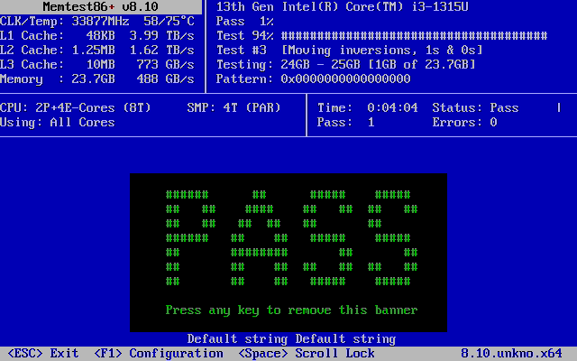
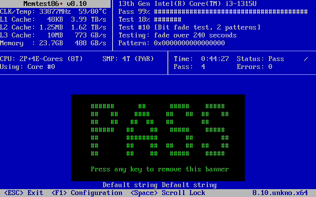
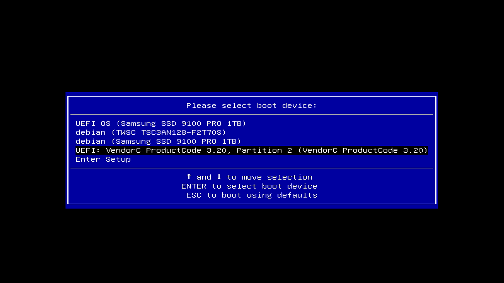

# Homelab Server Blueprint & Build Journal

**This is my active homelab and the successor to my original VMware-based lab. Where the legacy lab ran nested inside a desktop, this one runs on dedicated server hardware with real storage redundancy, network segmentation, and power protection. This document will be updated frequently as the build progresses.**

**Documentation Goal:** Everything here is written so that someone could replicate this build from scratch by following along. That means starting at the fundamentals and working up, so early entries will cover ground that may seem basic.

## Table of Contents

- [Phase 1 – Core Components](#phase1)
  - [Hardware Inventory](#Hardware_Inventory)
  - [Topology – Core Setup](#Topology_Core_Setup)
- [Phase 1.5 – Memory Validation](#phase1_5)
- [Phase 2 – Proxmox VE Installation](#phase2)
  - [Booting the Installer](#Booting_The_Installer)
- [Next Up](#Next_Up)

<h1 align="center"><strong>Phase 1 – Core Components</strong></h1>

### Objective
Assemble the physical foundation of the homelab: install storage and memory into the NAS chassis, connect it to the network and power protection, and confirm the system reaches firmware before any operating system work begins.

### Overview
The legacy lab ran entirely inside VMware Workstation on my desktop, which meant no VM could stay online when I needed the machine for anything else. This build moves the lab onto dedicated hardware so it can run continuously.

The chassis is a UGREEN NASync DXP4800 Pro. It ships as a turnkey NAS appliance, but the underlying hardware is standard x86 with an Intel CPU, DDR5 SODIMM slots, four SATA bays, and two M.2 NVMe slots, which makes it a viable hypervisor host. This phase covers only the physical build. Nothing is installed yet.

<h1 align="center"><strong>Hardware Inventory</strong></h1>

### Included With the DXP4800 Pro

| Component | Specification |
|---|---|
| CPU | Intel Core i3-1315U (6 cores / 8 threads, up to 4.5GHz turbo) |
| Memory | 8GB DDR5 SODIMM (2 slots, expandable to 96GB) |
| System Storage | 128GB built-in SSD, preloaded with UGOS Pro |
| Drive Bays | 4x SATA (sold diskless) |
| Expansion Storage | 2x M.2 NVMe slots |
| Networking | 1x 10GbE, 1x 2.5GbE |
| Video Out | 4K HDMI |

### Added To The Build

| Component | Specification | Purpose |
|---|---|---|
| Memory | Crucial 16GB DDR5-5600 CL46 SODIMM (1.1V) | Expands host memory to 24GB for VM headroom |
| NVMe SSD | Samsung 9100 PRO 1TB | Proxmox VE install and active VM disks |
| HDD | WD Red Plus 4TB | ZFS mirror member |
| HDD | Toshiba 4TB | ZFS mirror member |
| Power Protection | APC BR1500MS2 UPS | Graceful shutdown on power loss |

### A Note On The Mirror Drives

The two mirror members are not a matched pair, and that was circumstance rather than design. The WD Red Plus was bought for this build. The Toshiba was a 4TB drive I already had on hand, and using it meant the mirror cost half of what a second new drive would have.

Worth being precise about what does and does not matter here:

- **Capacity is what ZFS actually cares about.** A mirror is limited by its smallest member, so a 4TB and a 6TB drive would give 4TB of usable space and waste the difference. Both drives being 4TB is the requirement that was genuinely met.
- **Different manufacturers is a real, if accidental, benefit.** Two drives from the same brand and production batch carry correlated failure risk, and a mirror rebuild is exactly the moment when a second failure does the most damage. I did not buy for this property, but the configuration has it.
- **The Toshiba is not a NAS-class drive.** It is a general-purpose desktop disk being asked to do continuous-duty work in a mirror. It is the member I expect to fail first, and it is the one I will be watching in SMART.

<em>Documenting the honest reason here rather than the flattering one, because the drive that is most likely to fail is worth knowing about in advance.</em>

### A Note On Memory Configuration

The DXP4800 Pro ships with a single 8GB DDR5 SODIMM and leaves the second slot empty. That gave two options for the upgrade.

| Option | Result | Trade-off |
|---|---|---|
| Add the 16GB alongside the stock 8GB | 24GB total, flex mode | 16GB runs dual-channel interleaved, the remaining 8GB runs single-channel |
| Replace the stock 8GB with the 16GB | 16GB total, single-channel | Leaves a slot open for a matched module later, but wastes the stock stick |

I went with adding it, for 24GB total. On a hypervisor, memory capacity is the binding constraint long before memory bandwidth is. Splunk alone will comfortably take 8GB or more, pfSense wants 2GB, and every lab VM after that competes for what's left. Losing some interleaving on a third of the pool is a far cheaper price than being unable to keep VMs powered on.

Two things worth documenting for anyone replicating this:

- **The module is rated DDR5-5600, but the i3-1315U memory controller tops out at DDR5-5200.** It will train down to 5200 automatically with no configuration needed. Buying 5600 is not a mistake, it just will not run at its rated speed on this platform.
- **This platform does not support ECC memory.** This matters because ZFS is being used later in the build, and ZFS is frequently paired with ECC in production guidance. Non-ECC ZFS is still substantially safer than a non-checksumming filesystem, but the distinction should be stated plainly rather than glossed over.

<em>Running two modules of different capacities is a supported configuration, but it is not the configuration the platform is validated against. Memtest86+ should be run before trusting the system with anything, and that validation is Phase 1.5.</em>

### A Note On The 128GB System SSD

The DXP4800 Pro ships with a built-in 128GB SSD carrying UGOS Pro, UGREEN's stock operating system. Proxmox is going on the Samsung NVMe instead, and the 128GB drive is being left completely untouched.

The reason is recoverability. UGOS Pro is not distributed as a downloadable image, so if that drive gets wiped there is no straightforward way to restore the appliance to factory condition. Leaving it intact preserves a rollback path if the hypervisor experiment ever needs to be reversed, and keeps warranty and resale options open.

<em>This is a reversible-by-default decision. Wiping the stock OS would free almost nothing useful, while keeping it costs nothing and preserves an exit.</em>

### Steps

#### 1. Power down and open the chassis
- Disconnect power and any network cables before opening the unit.
- The DXP4800 Pro exposes both the SODIMM slots and the M.2 slots without requiring full disassembly.

#### 2. Install the memory module
- Locate the empty SODIMM slot. The factory 8GB module stays in place.
- Insert the Crucial 16GB stick at roughly a 30-degree angle until the contacts seat fully, then press down until both retention clips click.
- Do not force it. DDR5 SODIMMs are keyed, and a module that will not seat is almost always misaligned rather than incompatible.

#### 3. Install the NVMe SSD
- Seat the Samsung 9100 PRO in the first M.2 slot at roughly a 30-degree angle, then press flat and secure the retaining screw.
- The second M.2 slot is left empty for now, reserved for future expansion.

#### 4. Install the SATA drives
- Insert the WD Red Plus and Toshiba drives into the drive bays.
- Note which physical bay each drive occupies. This matters later when identifying disks by serial number during ZFS pool creation, and it is far easier to record now than to work out afterward.

#### 5. Reassemble and connect
- Close the chassis and reconnect power through the UPS, not directly to the wall outlet.
- Connect the network cable. The 2.5GbE port is sufficient for initial setup.

#### 6. Verify the system posts
- Connect a monitor via HDMI and a USB keyboard.
- Power on and confirm the system reaches firmware.
- Enter BIOS and confirm all of the following before going any further:
  - Total memory reports **24576 MB / 24GB**
  - Memory speed reports **5200 MT/s**
  - The Samsung NVMe is detected
  - Both SATA drives are detected

<em>Confirming every component appears in BIOS at this stage prevents a great deal of confusion later. A drive that is seated poorly will often look fine physically while remaining completely invisible to the operating system, and a memory module that reports the wrong total is usually a seating problem rather than a defect.</em>

<h1 align="center"><strong>Topology – Core Setup</strong></h1>

  

<em>At this stage the topology is deliberately flat. The NAS sits on the existing home network with no segmentation, no hypervisor, and no monitoring. Every diagram that follows will be a revision of this one as the architecture develops.</em>

<h1 align="center"><strong>Phase 1.5 – Memory Validation</strong></h1>

### Objective
Prove that the mixed-capacity memory configuration is stable under sustained load before any operating system is written to disk.

### Overview
This sits between the physical build and the install because it is the last point at which a memory problem is cheap to find. Nothing has been written to any drive yet, so a failure here costs a module swap rather than a rebuild.

Both sticks in this system are new. The 8GB shipped with the chassis and the Crucial 16GB was bought for this build. The reason the configuration needs proving is not where the parts came from, it is that they are different capacities.

Two matched modules train to one common configuration and run fully interleaved across both channels. Two modules of different sizes cannot. The controller runs the matched portion of the pool in dual channel and the remainder in single channel, so part of the address space is accessed differently from the rest. The two sticks also carry their own timings and their own SPD profiles, and the controller has to settle on parameters that satisfy both. Flex mode is a supported configuration and none of this is exotic, but it is not what a vendor validates against, and it is worth an hour to confirm rather than assume.

The cost of getting this wrong is what makes it worth the time. Memory faults on a hypervisor host do not present as clean failures. They present as random VM crashes, corrupted guest filesystems, and ZFS checksum errors that get misattributed to software for weeks before anyone thinks to test the RAM.

### Steps

#### 1. Write Memtest86+ to a USB drive and boot from it
- Memtest86+ is free and open source, and is the version used throughout this build.
- Write the ISO to a USB drive and select it from the boot device menu.
- Connect the keyboard before powering on, not after. See the note at the end of this phase.
- The test starts automatically once loaded. No configuration is required for a standard validation run.

  

<em>The display during normal testing, taken during an earlier validation run. The header confirms what the firmware reported: an i3-1315U addressing 23.7GB of usable memory across 8 threads. Test #5 uses moving inversions with a random pattern, one of several patterns cycled through within a single pass.</em>

#### 2. Let the first pass complete
- A pass is one full cycle through every test pattern across the entire address range.
- Watch the error counter, not the clock. A single error at any point invalidates the configuration.

  

<em>First pass complete with zero errors, four minutes in. This confirms the two modules train together and that the full address range is reachable, which is the narrow question one pass is capable of answering. The green banner is Memtest's own startup notice and clears on any keypress.</em>

#### 3. Keep running past the first pass
- Four passes were run on this system, taking roughly forty-five minutes in total.
- Stop only when the system has held steady-state temperature across multiple consecutive passes with a clean error count.
- If any error appears, pull one module and test each stick individually to determine whether the fault is a specific module or the pairing itself.

  

<em>Four passes, forty-four minutes, zero errors. The test running at this point is #10, the bit fade test, which writes a pattern and holds it in memory for 240 seconds before verifying it is still intact.</em>

### A Note On Pass Count

Most guidance says to run at least one full pass. One pass is worth running, but it answers a narrow question: whether the two modules are grossly incompatible. It does not establish stability.

The reason to keep going is thermal. Memory faults in a mixed-capacity configuration are frequently marginal rather than absolute, meaning the module addresses correctly when cool and starts dropping bits once it has heat-soaked. Across this run the reported temperature climbed from 62°C in the opening minutes to 80°C by the end. Pass 1 tested cold silicon. Pass 4 tested the same silicon at roughly the temperature it will sit at once the hypervisor is running VMs around the clock. Those are not the same test.

Test ordering matters too. Memtest86+ does not weight every pattern equally within a pass, and the longer-duration tests surface late. Test #10, the bit fade test, holds patterns in memory for four minutes at a time specifically to catch cells that lose charge. A single truncated pass can finish without ever reaching the tests most likely to expose a marginal module.

Four passes was a stopping point rather than a fixed target. By then the system had been at steady-state temperature for the majority of the run with a clean error count, and further passes would have largely repeated conditions already covered. Running overnight is still the more thorough option if the hardware can be spared for it.

<em>One note specific to this chassis: hot-plugging a USB keyboard mid-run was not registered by Memtest, which left no way to exit cleanly. Ending the session with a hard power-off is safe here, because Memtest86+ writes nothing to disk. Connect the keyboard before booting the test to avoid this entirely.</em>

<h1 align="center"><strong>Phase 2 – Proxmox VE Installation</strong></h1>

### Objective
Install Proxmox VE to the Samsung NVMe and bring the host up as a functioning hypervisor, leaving the factory UGOS installation on the built-in 128GB SSD intact.

### Overview
Phase 1.5 ended with validated hardware and no operating system. This phase replaces the appliance's intended role entirely. Instead of running UGOS Pro as a turnkey NAS, the box becomes a bare-metal hypervisor, with storage services later provided by VMs and containers running on top of Proxmox rather than by the vendor firmware.

The important constraint carried forward from Phase 1 is that the 128GB system SSD is not a target. Proxmox goes on the Samsung 9100 PRO, and the installer's disk selection step is where that decision has to be enforced deliberately, because selecting the wrong disk here is the one irreversible mistake available in this build.

### Steps

#### 1. Write the Proxmox VE ISO to a USB drive
- Download the Proxmox VE installer ISO from the official Proxmox site.
- Write it to a USB drive. The image is a hybrid ISO and can be written directly to the block device.
- Verify the checksum published alongside the download before writing. A corrupted installer image fails in confusing ways well into the install rather than at the start.

#### 2. Boot from the USB drive
- Connect the keyboard and monitor before powering on.
- Interrupt the boot process to reach the firmware boot device menu.
- The USB installer will not appear under a recognizable brand name. On this platform it shows up as a generic UEFI entry with a vendor and product code string.

  

<em>Select the entry ending in Partition 2, which is the EFI system partition on the installer media, rather than the drive's own top-level entry. This is the most common place to get stuck at this step, because the generic vendor string gives no indication of which entry is the bootable one.</em>

<em>One thing to note about this screenshot: it was taken after installation was already complete, so the Debian entries shown will not be present on a first boot. The TWSC entry is the factory UGOS installation on the built-in 128GB SSD, which is Debian-based. The Samsung entries were written by the Proxmox install. On a clean system, expect only the USB entry and the firmware setup option.</em>

#### 3. Select the installation target
- **Coming soon.**

<h1 align="center"><strong>Next Up</strong></h1>
- Completing the Phase 2 installation walkthrough: disk selection, filesystem choice, and initial network configuration
- Post-install base configuration: repository sources, updates, and notification setup
- Storage: ZFS mirror creation on the WD Red Plus and Toshiba drives

## About Me
Josip Huzovic  
josiphuzovic@gmail.com  
[LinkedIn Profile](https://www.linkedin.com/in/josip-huzovic)