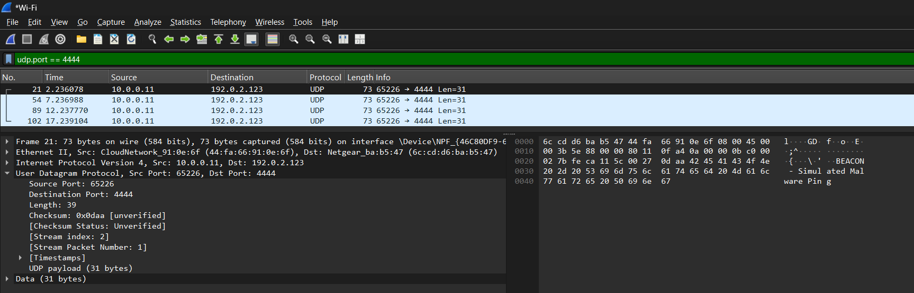
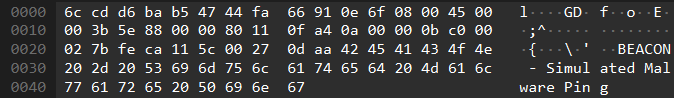

# Malware Beacon Simulation – Blueprint

## Objective
Simulate malicious beaconing behavior to understand how abnormal outbound traffic appears in a packet capture. The goal is to generate controlled “fake malware” traffic and analyze it in Wireshark for defensive training and portfolio demonstration.

---

## Design
- **Language**: Python  
- **Traffic Type**: UDP packets sent at regular intervals to a chosen target IP/port  
- **Payload**: Simple hardcoded strings mimicking exfiltration or heartbeat messages  
- **Environment**:  
  - Local machine running the script  
  - Wireshark capturing network activity  
- **Safety**: No real data exfiltration, packets sent to non-routable/private IP or loopback

---

## Execution
1. Start Wireshark and begin capturing traffic on Wi-Fi.  
2. Run the malware_beacon Python script to generate repeated UDP packets.  
3. Stop the capture in Wireshark and end the Python script (`Ctrl+C`).  
4. Apply a display filter in Wireshark:  
   `udp.port == 4444`  
5. Review the packet flow — noting source IP/port, destination IP/port, and payload content.  

  

6. Inspect the packet metadata and confirm the message we sent is visible.  

  

---

## Detection & Response
- **Indicators of Compromise (IoCs):**  
  - Repeated outbound UDP traffic with no legitimate service behind it  
  - Consistent beaconing interval (1–5 seconds)  
  - Unusual or unused high-numbered destination port  

- **Defensive Analysis:**  
  - Mapped activity to MITRE ATT&CK tactic **C2: Application Layer Protocol**  
  - Showed how recurring outbound beacons can be detected with SIEM/IDS rules  
  - Emphasized the value of metadata (source, destination, port, timing) even when payloads are encrypted  

---

## Outcomes
- Simulated beaconing behavior safely in a controlled environment  
- Practiced identifying and filtering suspicious traffic using Wireshark  
- Built a simple workflow for analyzing beacon-like patterns  
- Delivered a simple yet practical project to demonstrate packet analysis skills