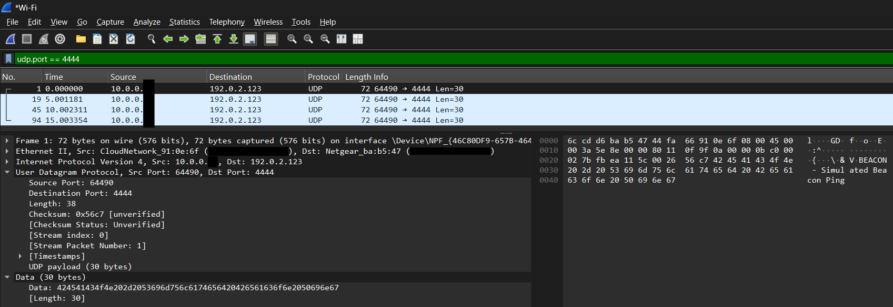
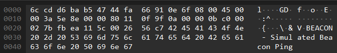

# Simulated Beaconing Traffic – Blueprint

## Objective
Simulate beaconing behavior to understand how abnormal outbound traffic appears in a packet capture. The goal is to generate **safe, malware-like beaconing traffic** and analyze it in Wireshark as part of defensive training and portfolio demonstration.

---

## Design
- **Language**: Python  
- **Traffic Type**: UDP packets sent at regular intervals to a chosen target IP/port  
- **Payload**: Simple hardcoded strings mimicking exfiltration or heartbeat messages  
- **Environment**:  
  - Local machine running the script  
  - Wireshark capturing network activity  
- **Safety**: No real data exfiltration, no malicious code, and packets sent to non-routable/private IP or loopback

---

## Execution
1. Begin capturing traffic on your active network interface (Wi-Fi or Ethernet)  
2. Run the [simulated_beacon](./simulated_beacon.py) Python script to generate repeated UDP packets.  
3. Stop the capture in Wireshark and end the Python script (`Ctrl+C`).  
4. Apply a display filter in Wireshark:  
   `udp.port == 4444`  
5. Review the packet flow. Make note of source IP/port, destination IP/port, and payload content.  

  

6. Inspect the packet metadata and confirm the message we sent is visible.  

  

---

## Simplified Indicators of Compromise (IoCs) Examples
- Repeated outbound UDP traffic with no legitimate service behind it  
- Consistent beaconing interval (1–5 seconds)  
- Unusual or unused high-numbered destination port  

---

## Outcome

**Congratulations!** By completing this project, you’ve successfully simulated and analyzed a simple form of beaconing traffic.  
Along the way, you have:

- Safely recreated malware-like beaconing in a controlled environment  
- Practiced spotting and filtering suspicious traffic patterns in Wireshark  
- Built a repeatable workflow for analyzing beacon-style communication  
- Produced a practical project to showcase foundational packet analysis skills  
